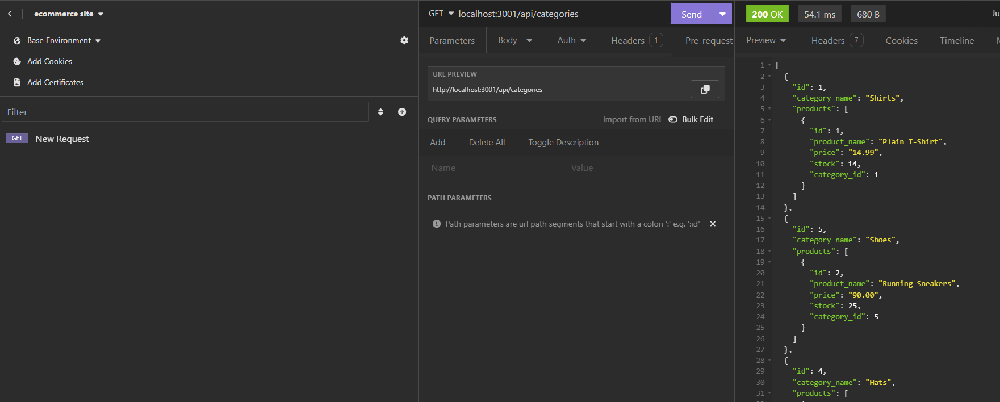

# ecommerce site

## Description

My assignment was to build the back end for an e-commerce site. I used an Express.js API and configured it to use Sequelize to interact with my PostgreSQL database.Because this application isn’t be deployed, I created a walkthrough video that demonstrates its functionality and all of the GET,POST,PUT routes being tested. 

## Link
https://www.youtube.com/watch?v=SA5kOkfsOHw 

## Screenshot 
